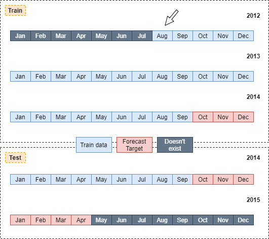

```{r setup, include=FALSE}
knitr::opts_chunk$set(echo = TRUE, 
                      fig.align = "center")

options(scipen = 999)
```


There is a company that consider making an investment in a new form of transportation - JetRail. JetRail uses Jet propulsion technology to run rails and move people at a high speed! While JetRail has mastered the technology and they hold the patent for their product, the investment would only make sense, if they can get more than 1 Million monthly users within next 18 months.

```{r, echo=FALSE}
knitr::include_graphics("rail.jpeg")
```

# Background {.tabset}
## Objective
This project is based on an active hackathon from [Analytics Vidhya](https://datahack.analyticsvidhya.com/contest/practice-problem-time-series-2/). They actively organize lots of different data analytics competition freely, thanks to them i can practice my time series forecasting knowledge. Lets imagine we're a data analyst hired by the company we talk before. In order to the company in their decision, **we need to forecast the traffic on JetRail for the next 7 months**. We are provided with traffic data of JetRail since inception in the test file. We'll try to build best forecasting self-evaluation using cross validation technique and also evaluated from the competition website by submitting our forecast.

## Libraries
You can load the package into your workspace using the `library()` function

```{r warning=FALSE, message=FALSE}
library(forecast)
library(dplyr)
library(fpp)
library(MLmetrics)
library(tseries)
library(lubridate)
library(TSstudio)
library(xts)
library(ggplot2)
library(ggrepel)
library(plotly)
```

# Let's Begin
## Data Import

```{r}
dat <- read.csv("train.csv")
head(dat)
```

Based on the website, the data is simply contained hourly data from its first launch (`Datetime`) and the amount of passengers (`Count`) in that time. We need to change `Datetime` column to date format and remove `ID` column

```{r}
dat <- dat %>% 
  mutate(Datetime = dmy_hm(Datetime)) %>%
  select(-ID) %>%
  arrange(Datetime)

dat
```

Time series is a method of analyzing and processing data in which the values are affected by time. The action of predicting future values based on its value in the previous period of time is called forecasting.

The data which formatted into a time series (ts) object must have some characteristics:

- no missing intervals   
- no missing values   
- data should be ordered by time   

```{r}
# no missing intervals
interval(start = head(dat$Datetime)[1],end = tail(dat$Datetime)[1],tzone = "UTC")
# no missing values
anyNA(dat)
# Date range
range(dat$Datetime)
```
## Exploratory Data Analysis
First let's see how our data visualized in a simple line chart
```{r}
dat %>%
  ggplot(aes(x = Datetime, y = Count)) +
  geom_line(color = "firebrick") + theme_minimal() +
  geom_point(data = dat[dat$Count == max(dat$Count),],
             aes(x = Datetime, y = Count), color = "blue") +
  geom_text_repel(data = dat[dat$Count == max(dat$Count),],
             aes(x = Datetime, y = Count, label = Count)) +
  labs(title = "JetRail Traffic (hourly)",
       subtitle = "25 August 2012 - 25 September 2014",
       y = "Number of passenger")

```

The traffic is multiplying over time with a peak of 1244 passengers in an hour. This growth means the company is growing and that's a good sign for us if we want to invest on them. Problem is how much it will grow after this? what caused the growth? and how many passengers it will be 7 months after this? To answer that, we need to transform the data to Time Series object.

Before doing that, lets see our main objective
```{r}
test <- read.csv("test.csv")
test$Datetime <- dmy_hm(test$Datetime)
range(test$Datetime)
```
We need to predict 26 September 2014 to 26 April 2015. Our train data start from 25 August 2012 to 25 September 2014. There is a month gap in train data to make our data in exact;y 3 years long. let me illustrate it for you



I hope its much clearer now. see that silly arrow, that's the gap. We'll remove any data in August 2012 so that our data can be exact 3 years.
```{r}
dat <- dat %>% filter(Datetime >= as.POSIXct("2012-09-25 00:00:00",tz = "uTC"))
```


# Time Series Object
```{r}
ts_dat <- ts(dat, frequency = 24)
ts_dat %>% head(24*30*5) %>% 
  decompose() %>% autoplot()
```

Decomposing a time series means separating it into its constituent components. In this, plot we 'separate' the data into daily observed periods, but since the date point is too long (imagine 2.5 years data divided by hours) i only plot the first 5 months.

- The first panel from top is the original, observed time series.   
- The second panel is the error component, which is determined by removing the trend and seasonal figure   
- The third panel plots the seasonal component, with the figure being computed by taking the average for each time unit over all periods and then centering it around the mean   
- The last panel plots the trend component, using a moving average with asymmetric window with equal weights. This means that for each point on the series, a new value is estimated by taking the average of the point itself   

In the second panel, 'wiggly' trend pattern indicates there's uncaptured extra seasonality from higher natural period. It can be considered as multi-seasonal data. However `ts()` and `decompose()` are not able to capture multi-seasonal data. To solve this complex seasonality, we need to convert the data into `msts()` object which accept multiple frequency setting. To decompose multi-seasonal time series, we use `mstl()` function.

```{r}
# building multi seasonal time series with daily and weekly frequency
mts.dat <- msts(dat$Count, seasonal.periods = c(24,24*7))
mts.dat %>% head(24*7*9) %>% mstl() %>% autoplot()

```

From this step, we need to adjust frequency as detail as possible to 'capture' every seasonality. Last panel in the plot above indicates there's still a hidden seasonality we're not captured yet, remember error is the residual of value that is not captured neither by trend or seasonal. If its have a pattern, means they still have hidden seasonality. We need to add more time period, this time we include monthly

```{r}
# building multi seasonal time series with daily, weekly, and monthly frequency
mts.dat.2 <- msts(dat$Count, seasonal.periods = c(24,24*7,24*7*4))
mts.dat.2 %>% head(24*7*4*3) %>% mstl() %>% autoplot()
```

Now we have 3 seasonality periods, the trend panel stretched  smoothly, and the error is ...quite good actually, i mean its better than before. If we confident enough to our ts data, then we save to move to modeling step

# Forecasting
## Cross validation

quite same as another machine learning method, we need to split our data to train and test. test data will be used to evaluate our model. We gonna set forecast length to 5 months. Also it looks like we're gonna split a lot of data (because we will use different tune of model), in that case  we will build function to splitting date period easily and fairly.
```{r}
cv_train <- function(x){
  # 24*7*4*7 is simply means daily time times 7 day times 4 weeks times 5 months
  train <- head(x, length(x) - 24*7*4*5)
}

cv_test <- function(x){
  test <- tail(x,24*7*4*5)
}

train_1 <- cv_train(mts.dat.2)
test_1 <- cv_test(mts.dat.2)
```


## Modeling
There are few different forecasting models in R, namely: `Naive Model`, `Simple Moving Average`, `Exponential Smoothing`, and `ARIMA`. Since we are using multi-seasonal time series data, we cant use `stl()` (the only function who covers naive forecasting model) function for modeling with naive model. Thus, we will throw naive model from our model option. Prof. Rob J Hyndman, [in his website](https://robjhyndman.com/hyndsight/longseasonality/), also said "*The `ets()` function in the forecast package restricts seasonality to be a maximum period of 24 to allow hourly data but not data with a larger seasonal frequency ... So for large frequency the estimation becomes almost impossible.*". We have 13584 data points in 672 frequency, thus we also cant use `ets()` model. So our option is only seasonal ARIMA. we can apply multi-seasonal time series to ARIMA model using `stlm()` function.

```{r}
# lambda = 0 -> deactive log transformation
# method = arima -> choosing arima method
mod_1 <- train_1 %>% stlm(lambda = 0,method = "arima")
```

## Forecast and evaluation

We will use `accuracy()` function from `forecast` package to calculate every possible matrics 

```{r}
# forecast
forecast_1 <- forecast(object = mod_1,h = length(test_1))
# evaluation
eval_1 <- accuracy(as.vector(forecast_1$mean),test_1)
data.frame(eval_1)
```

Since there are no other models to compare (yet), we'll look at MAPE. It says 22.4, means there's 22.4% miss-forecasted in our forecast data. Lets see how it looks in visualization

```{r}
forecast_plot <- ggplot() +
  geom_line(aes(x = (dat$Datetime %>% tail(24*7*4*7)),y = (dat$Count %>% tail(24*7*4*7)),color = "actual")) +
  geom_line(aes(x = (dat$Datetime %>% tail(24*7*4*5)),y = forecast_1$mean, color = "forecasted")) +
  theme_minimal() +
  labs(title = "Forecast using ARIMA",
       x = "Date time", y = "Count")

ggplotly(forecast_plot)
```

First of all, we try to forecast a long period of time. it's hard to achieve such a low error. But it doesn't mean we shouldn't try another tuning. See, in our modeling step we only use `lambda=` and `method=` parameter. there's another parameter worth to check. And also its a good idea to change the frequency period to discover another seasonality. From now on, we will try: 1. find a good combination of frequency to capture different seasonality, 2. find proper parameter in tuning steps.

# Forecast Model Tuning {.tabset}
Surprise surprise! looks like ARIMA is not the only option. Prof. Rob in our wonderful [otext](https://otexts.com/fpp2/complexseasonality.html) handbook also mention `TBATS models`. A TBATS model differs from dynamic harmonic regression in that the seasonality is allowed to change slowly over time in a TBATS model, while harmonic regression terms force the seasonal patterns to repeat periodically without changing. But one disadvantage to using this model is that they can be slow to estimate long time series data like ours. I will propose different combinations of frequency and model it using both ARIMA and TBATS.   
**note:**otext module also said `arima()` function will allow a seasonal period up to m = 350 but in practice will usually run out of memory whenever the seasonal period is more than about 200. So we'll try to avoid annual period and set quarterly (3 months) as our max period.

## half day / daily
```{r}
# building multi seasonal time series with half day and daily frequency
mts_1 <- msts(dat$Count, seasonal.periods = c(12,2*12))
mts_1 %>% head(12*2*7*3) %>% mstl() %>% autoplot()
```

Model and evaluate
```{r}
# Cross Validation
train_1 <- cv_train(mts_1)
test_1 <- cv_test(mts_1)

# Arima Modeling
mod_1_A <- train_1 %>% stlm(lambda = 0,method = "arima",
                            s.window = "periodic")
# Tbats modeling
# mod_1_B <- train_1 %>%
#   tbats(use.trend = T,use.damped.trend = T,use.box.cox = F)

# for the sake of shorten-time consumption, i write the model to rds data and re-load it
#saveRDS(mod_1_B,"mod_1_b.rds")
mod_1_B <- readRDS("mod_1_b.rds")

# forecast
forecast_1_A <- forecast(object = mod_1_A,h = length(test_1))
forecast_1_B <- forecast(object = mod_1_B,h = length(test_1))

# evaluation
eval_1 <- data.frame(rbind(accuracy(as.vector(forecast_1_A$mean),test_1),
                           accuracy(as.vector(forecast_1_B$mean),test_1))) %>%
  mutate(Model = c("ARIMA_1","TBATS_1"))

eval_1
```

```{r}
plot_1 <- ggplot() +
  geom_line(aes(x = (dat$Datetime %>% tail(24*7*4*7)),y = (dat$Count %>% tail(24*7*4*7)),color = "actual")) +
  geom_line(aes(x = (dat$Datetime %>% tail(24*7*4*5)),y = forecast_1_A$mean, color = "ARIMA")) +
  geom_line(aes(x = (dat$Datetime %>% tail(24*7*4*5)),y = forecast_1_B$mean, color = "TBATS")) +
  theme_minimal() +
  labs(title = "Forecast using ARIMA & TBATS",
       subtitle = "half day & daily frequency",
       x = "Date time", y = "Count")

ggplotly(plot_1)
```

In this frequency TBATS maybe win in MAPE but it has a really bad MAE and RMSE. let's consider it a tie.

## half day / daily / weekly
```{r}
# building multi seasonal time series with half day, daily, and weekly frequency
mts_2 <- msts(dat$Count, seasonal.periods = c(12,2*12,2*12*7))
mts_2 %>% head(12*2*7*3) %>% mstl() %>% autoplot()
```

Model and evaluate
```{r}
# Cross Validation
train_2 <- cv_train(mts_2)
test_2 <- cv_test(mts_2)

# Arima Modeling
mod_2_A <- train_2 %>% stlm(lambda = 0,method = "arima",
                            s.window = "periodic")
# Tbats modeling
# mod_2_B <- train_2 %>%
#   tbats(use.trend = T,use.damped.trend = F,use.box.cox = F)

# for the sake of shorten-time consumption, i write the model to rds data and re-load it
#saveRDS(mod_2_B,"mod_2_b.rds")
mod_2_B <- readRDS("mod_2_b.rds")

# forecast
forecast_2_A <- forecast(object = mod_2_A,h = length(test_2))
forecast_2_B <- forecast(object = mod_2_B,h = length(test_2))

# evaluation
eval_2 <- data.frame(rbind(accuracy(as.vector(forecast_2_A$mean),test_2),
                           accuracy(as.vector(forecast_2_B$mean),test_2))) %>%
  mutate(Model = c("ARIMA_2","TBATS_2"))

eval_2
```

```{r}
plot_2 <- ggplot() +
  geom_line(aes(x = (dat$Datetime %>% tail(24*7*4*7)),y = (dat$Count %>% tail(24*7*4*7)),color = "actual")) +
  geom_line(aes(x = (dat$Datetime %>% tail(24*7*4*5)),y = forecast_2_A$mean, color = "ARIMA")) +
  geom_line(aes(x = (dat$Datetime %>% tail(24*7*4*5)),y = forecast_2_B$mean, color = "TBATS")) +
  theme_minimal() +
  labs(title = "Forecast using ARIMA & TBATS",
       subtitle = "half day, daily, weekly frequency",
       x = "Date time", y = "Count")

ggplotly(plot_2)
```

## half day / daily / weekday
```{r}
# building multi seasonal time series with half day, daily, and weekday frequency
mts_3 <- msts(dat$Count, seasonal.periods = c(12,2*12,2*12*5))
mts_3 %>% head(12*2*7*3) %>% mstl() %>% autoplot()
```

Model and evaluate
```{r}
# Cross Validation
train_3 <- cv_train(mts_3)
test_3 <- cv_test(mts_3)

# Arima Modeling
mod_3_A <- train_3 %>% stlm(lambda = 0,method = "arima",
                            s.window = "periodic")
# Tbats modeling
# mod_3_B <- train_3 %>%
#   tbats(use.trend = T,use.damped.trend = T,use.box.cox = F)

# for the sake of shorten-time consumption, i write the model to rds data and re-load it
#saveRDS(mod_3_B,"mod_3_b.rds")
mod_3_B <- readRDS("mod_3_b.rds")

# forecast
forecast_3_A <- forecast(object = mod_3_A,h = length(test_3))
forecast_3_B <- forecast(object = mod_3_B,h = length(test_3))

# evaluation
eval_3 <- data.frame(rbind(accuracy(as.vector(forecast_3_A$mean),test_3),
                           accuracy(as.vector(forecast_3_B$mean),test_3))) %>%
  mutate(Model = c("ARIMA_3","TBATS_3"))

eval_3
```

```{r}
plot_3 <- ggplot() +
  geom_line(aes(x = (dat$Datetime %>% tail(24*7*4*7)),y = (dat$Count %>% tail(24*7*4*7)),color = "actual")) +
  geom_line(aes(x = (dat$Datetime %>% tail(24*7*4*5)),y = forecast_3_A$mean, color = "ARIMA")) +
  geom_line(aes(x = (dat$Datetime %>% tail(24*7*4*5)),y = forecast_3_B$mean, color = "TBATS")) +
  theme_minimal() +
  labs(title = "Forecast using ARIMA & TBATS",
       subtitle = "half day, daily, weekday frequency",
       x = "Date time", y = "Count")

ggplotly(plot_3)
```

## half day / daily / weekly / monthly
```{r}
# building multi seasonal time series with half day, daily, weekly, and monthy frequency
mts_4 <- msts(dat$Count, seasonal.periods = c(12,2*12,2*12*7,2*12*7*4))
mts_4 %>% head(12*2*7*4*3) %>% mstl() %>% autoplot()
```

Model and evaluate
```{r}
# Cross Validation
train_4 <- cv_train(mts_4)
test_4 <- cv_test(mts_4)

# Arima Modeling
mod_4_A <- train_4 %>% stlm(lambda = 0,method = "arima",
                            s.window = "periodic")
# Tbats modeling
# mod_4_B <- train_4 %>%
#   tbats(use.trend = T,use.damped.trend = T,use.box.cox = F)

# for the sake of shorten-time consumption, i write the model to rds data and re-load it
#saveRDS(mod_4_B,"mod_4_b.rds")
mod_4_B <- readRDS("mod_4_b.rds")

# forecast
forecast_4_A <- forecast(object = mod_4_A,h = length(test_4))
forecast_4_B <- forecast(object = mod_4_B,h = length(test_4))

# evaluation
eval_4 <- data.frame(rbind(accuracy(as.vector(forecast_4_A$mean),test_4),
                           accuracy(as.vector(forecast_4_B$mean),test_4))) %>%
  mutate(Model = c("ARIMA_4","TBATS_4"))

eval_4
```

```{r}
plot_4 <- ggplot() +
  geom_line(aes(x = (dat$Datetime %>% tail(24*7*4*7)),y = (dat$Count %>% tail(24*7*4*7)),color = "actual")) +
  geom_line(aes(x = (dat$Datetime %>% tail(24*7*4*5)),y = forecast_4_A$mean, color = "ARIMA")) +
  geom_line(aes(x = (dat$Datetime %>% tail(24*7*4*5)),y = forecast_4_B$mean, color = "TBATS")) +
  theme_minimal() +
  labs(title = "Forecast using ARIMA & TBATS",
       subtitle = "half day, daily, weekly, monthly frequency",
       x = "Date time", y = "Count")

ggplotly(plot_4)
```


## daily / monthly / quarterly
```{r}
# building multi seasonal time series with daily, monthly, quarterly frequency
mts_5 <- msts(dat$Count, seasonal.periods = c(24,24*7*4,24*7*4*3))
mts_5 %>% head(24*7*4*3*5) %>% mstl() %>% autoplot()
```

Model and evaluate
```{r}
# Cross Validation
train_5 <- cv_train(mts_5)
test_5 <- cv_test(mts_5)

# Arima Modeling
mod_5_A <- train_5 %>% stlm(lambda = 0,method = "arima",
                            s.window = "periodic")
# Tbats modeling
# mod_5_B <- train_5 %>% log %>%
#   tbats(use.trend = T,use.damped.trend = T,use.box.cox = F)

# for the sake of shorten-time consumption, i write the model to rds data and re-load it
#saveRDS(mod_5_B,"mod_5_b.rds")
mod_5_B <- readRDS("mod_5_b.rds")

# forecast
forecast_5_A <- forecast(object = mod_5_A,h = length(test_5))
forecast_5_B <- forecast(object = mod_5_B,h = length(test_5))

# evaluation
eval_5 <- data.frame(rbind(accuracy(as.vector(forecast_5_A$mean),test_5),
                           accuracy(as.vector(exp(forecast_5_B$mean)),test_5))) %>%
  mutate(Model = c("ARIMA_5","TBATS_5"))

eval_5
```

```{r}
plot_5 <- ggplot() +
  geom_line(aes(x = (dat$Datetime %>% tail(24*7*4*7)),y = (dat$Count %>% tail(24*7*4*7)),color = "actual")) +
  geom_line(aes(x = (dat$Datetime %>% tail(24*7*4*5)),y = forecast_5_A$mean, color = "ARIMA")) +
  geom_line(aes(x = (dat$Datetime %>% tail(24*7*4*5)),y = exp(forecast_5_B$mean), color = "TBATS")) +
  theme_minimal() +
  labs(title = "Forecast using ARIMA & TBATS",
       subtitle = "daily, monthly, quarterly frequency",
       x = "Date time", y = "Count")

ggplotly(plot_5)
```

## daily / weekly / monthly
```{r}
# building multi seasonal time series with daily, weekly, monthly frequency
mts_6 <- msts(dat$Count, seasonal.periods = c(24,24*7,24*7*4))
mts_6 %>% head(24*7*4*3) %>% mstl() %>% autoplot()
```

Model and evaluate
```{r}
# Cross Validation
train_6 <- cv_train(mts_6)
test_6 <- cv_test(mts_6)

# Arima Modeling
mod_6_A <- train_6 %>% stlm(lambda = 0,method = "arima",
                            s.window = "periodic")
# Tbats modeling
# mod_6_B <- train_6 %>% log %>%
#   tbats(use.trend = T,use.damped.trend = T,use.box.cox = F)

# for the sake of shorten-time consumption, i write the model to rds data and re-load it
#saveRDS(mod_6_B,"mod_6_b.rds")
mod_6_B <- readRDS("mod_6_b.rds")

# forecast
forecast_6_A <- forecast(object = mod_6_A,h = length(test_6))
forecast_6_B <- forecast(object = mod_6_B,h = length(test_6))

# evaluation
eval_6 <- data.frame(rbind(accuracy(as.vector(forecast_6_A$mean),test_6),
                           accuracy(as.vector(exp(forecast_6_B$mean)),test_6))) %>%
  mutate(Model = c("ARIMA_6","TBATS_6"))

eval_6
```

```{r}
plot_6 <- ggplot() +
  geom_line(aes(x = (dat$Datetime %>% tail(24*7*4*7)),y = (dat$Count %>% tail(24*7*4*7)),color = "actual")) +
  geom_line(aes(x = (dat$Datetime %>% tail(24*7*4*5)),y = forecast_6_A$mean, color = "ARIMA")) +
  geom_line(aes(x = (dat$Datetime %>% tail(24*7*4*5)),y = exp(forecast_6_B$mean), color = "TBATS")) +
  theme_minimal() +
  labs(title = "Forecast using ARIMA & TBATS",
       subtitle = "daily, weekly, monthly frequency",
       x = "Date time", y = "Count")

ggplotly(plot_6)
```

## daily / weekly / monthly / quarterly
```{r}
# building multi seasonal time series with daily, weekly, monthly, and quarterly frequency
mts_7 <- msts(dat$Count, seasonal.periods = c(24,24*7,24*7*4, 24*7*4*3))
mts_7 %>% head(24*7*4*3*5) %>% mstl() %>% autoplot()
```

Model and evaluate
```{r}
# Cross Validation
train_7 <- cv_train(mts_7)
test_7 <- cv_test(mts_7)

# Arima Modeling
mod_7_A <- train_7 %>% stlm(lambda = 0,method = "arima",
                            s.window = "periodic")
# Tbats modeling
# mod_7_B <- train_7 %>% log %>%
#   tbats(use.trend = T,use.damped.trend = T,use.box.cox = F)

# for the sake of shorten-time consumption, i write the model to rds data and re-load it
#saveRDS(mod_7_B,"mod_7_b.rds")
mod_7_B <- readRDS("mod_7_b.rds")

# forecast
forecast_7_A <- forecast(object = mod_7_A,h = length(test_7))
forecast_7_B <- forecast(object = mod_7_B,h = length(test_7))

# evaluation
eval_7 <- data.frame(rbind(accuracy(as.vector(forecast_7_A$mean),test_7),
                           accuracy(as.vector(forecast_7_B$mean),test_7))) %>%
  mutate(Model = c("ARIMA_7","TBATS_7"))

eval_7
```

```{r}
plot_7 <- ggplot() +
  geom_line(aes(x = (dat$Datetime %>% tail(24*7*4*7)),y = (dat$Count %>% tail(24*7*4*7)),color = "actual")) +
  geom_line(aes(x = (dat$Datetime %>% tail(24*7*4*5)),y = forecast_7_A$mean, color = "ARIMA")) +
  geom_line(aes(x = (dat$Datetime %>% tail(24*7*4*5)),y = forecast_7_B$mean, color = "TBATS")) +
  theme_minimal() +
  labs(title = "Forecast using ARIMA & TBATS",
       subtitle = "daily, weekly, monthly, quarterly frequency",
       x = "Date time", y = "Count")

ggplotly(plot_7)
```


## daily / weekly 
```{r}
# building multi seasonal time series with daily and weekly frequency
mts_8 <- msts(dat$Count, seasonal.periods = c(24,24*7))
mts_8 %>% head(24*7*8) %>% mstl() %>% autoplot()
```

Model and evaluate
```{r}
# Cross Validation
train_8 <- cv_train(mts_8)
test_8 <- cv_test(mts_8)

# Arima Modeling
mod_8_A <- train_8 %>% stlm(lambda = 0,method = "arima",
                            s.window = "periodic")
# Tbats modeling
mod_8_B <- train_8 %>% log %>%
  tbats(use.trend = T,use.damped.trend = T,use.box.cox = F)

# for the sake of shorten-time consumption, i write the model to rds data and re-load it
#saveRDS(mod_8_B,"mod_8_b.rds")
mod_8_B <- readRDS("mod_8_b.rds")

# forecast
forecast_8_A <- forecast(object = mod_8_A,h = length(test_8))
forecast_8_B <- forecast(object = mod_8_B,h = length(test_8))

# evaluation
eval_8 <- data.frame(rbind(accuracy(as.vector(forecast_8_A$mean),test_8),
                           accuracy(as.vector(exp(forecast_8_B$mean)),test_8))) %>%
  mutate(Model = c("ARIMA_8","TBATS_8"))

eval_8
```

```{r}
plot_8 <- ggplot() +
  geom_line(aes(x = (dat$Datetime %>% tail(24*7*4*7)),y = (dat$Count %>% tail(24*7*4*7)),color = "actual")) +
  geom_line(aes(x = (dat$Datetime %>% tail(24*7*4*5)),y = forecast_8_A$mean, color = "ARIMA")) +
  geom_line(aes(x = (dat$Datetime %>% tail(24*7*4*5)),y = exp(forecast_8_B$mean), color = "TBATS")) +
  theme_minimal() +
  labs(title = "Forecast using ARIMA & TBATS",
       subtitle = "daily, weekly frequency",
       x = "Date time", y = "Count")

ggplotly(plot_8)
```

## half day / daily / weekly / monthly / quarterly
```{r}
# building multi seasonal time series with daily and weekly frequency
mts_9 <- msts(dat$Count, seasonal.periods = c(12,12*2,12*2*7,12*2*7*4,12*2*7*4*3))
mts_9 %>% head(12*2*7*4*3*5) %>% mstl() %>% autoplot()
```

Model and evaluate
```{r}
# Cross Validation
train_9 <- cv_train(mts_9)
test_9 <- cv_test(mts_9)

# Arima Modeling
mod_9_A <- train_9 %>% stlm(lambda = 0,method = "arima",
                            s.window = "periodic")
# Tbats modeling
# mod_9_B <- train_9 %>% log %>%
#   tbats(use.trend = T,use.damped.trend = T,use.box.cox = F)

# for the sake of shorten-time consumption, i write the model to rds data and re-load it
#saveRDS(mod_9_B,"mod_9_b.rds")
mod_9_B <- readRDS("mod_9_b.rds")

# forecast
forecast_9_A <- forecast(object = mod_9_A,h = length(test_9))
forecast_9_B <- forecast(object = mod_9_B,h = length(test_9))

# evaluation
eval_9 <- data.frame(rbind(accuracy(as.vector(forecast_9_A$mean),test_9),
                           accuracy(as.vector(forecast_9_B$mean),test_9))) %>%
  mutate(Model = c("ARIMA_9","TBATS_9"))

eval_9
```

```{r}
plot_9 <- ggplot() +
  geom_line(aes(x = (dat$Datetime %>% tail(24*7*4*7)),y = (dat$Count %>% tail(24*7*4*7)),color = "actual")) +
  geom_line(aes(x = (dat$Datetime %>% tail(24*7*4*5)),y = forecast_9_A$mean, color = "ARIMA")) +
  geom_line(aes(x = (dat$Datetime %>% tail(24*7*4*5)),y = forecast_9_B$mean, color = "TBATS")) +
  theme_minimal() +
  labs(title = "Forecast using ARIMA & TBATS",
       subtitle = "half day, daily, weekly, monthly, quarterly frequency",
       x = "Date time", y = "Count")

ggplotly(plot_9)
```

# Convert to additive using log transform {.tabset}

It looks like high number of seasonality doesn't improve our model. The ability of your frequence to capture the seasonality is the key. however everytime i add more seasonal periods, the error in decompose plot are still there, which means they still have uncaptured seasonal. So at this point, i'll try to convert our multiplicative data to additive by simply transform the value using `log()`. After we model our additive data, forecast, then re-transform the forecast output using `exp()`.

First, i don't want to remodel every frequency combination. we'll choose the lowest RMSE and MAPE models.

```{r}
all.eval <- rbind(eval_1,eval_2,eval_3,eval_4,eval_5,
                  eval_6,eval_7,eval_8,eval_9)
# order by lowest MAPE
all.eval %>% arrange(-desc(MAPE))
```

It turns out our best model is ARIMA 2,8,4,6 and 9. Oh i don't include TBATS because i dont have confidence in that model. It have different result in the same tuning, sometimes we need to transform it first (log) sometimes it dont. and most importantly it takes a lot of time to train. 

```{r}
all.eval %>% arrange(-desc(RMSE))
```

Another metrics we want to consider is RMSE. Why? well the [competition](https://datahack.analyticsvidhya.com/contest/practice-problem-time-series-2/#ProblemStatement) use it to evaluate. Our best 5 model with lowest RMSE is ARIMA 2,8,4,6,1. So for our next step, we'll be using model ARIMA 2,8,4,6,1 and 9.

## half day / daily / weekly

```{r}
# Arima Modeling
mod_2_adt <- train_2 %>% log() %>%
  stlm(method = "arima", s.window = "periodic")

# forecast
forecast_2_adt <- forecast(object = mod_2_adt,h = length(test_2))

# evaluation
eval_2_adt <- data.frame(accuracy(as.vector(exp(forecast_2_adt$mean)),test_2)) %>%
  mutate(Model = "ARIMA_2_adt")

eval_2_adt
```

```{r}
plot_adt1 <- ggplot() +
  geom_line(aes(x = (dat$Datetime %>% tail(24*7*4*7)),y = (dat$Count %>% tail(24*7*4*7)),color = "actual")) +
  geom_line(aes(x = (dat$Datetime %>% tail(24*7*4*5)),y = exp(forecast_2_adt$mean), color = "ARIMA")) +
  theme_minimal() +
  labs(title = "Forecast using ARIMA & TBATS",
       subtitle = "half day, daily, weekly frequency - Additive",
       x = "Date time", y = "Count")

ggplotly(plot_adt1)
```

## daily / weekly 

```{r}
# Arima Modeling
mod_8_adt <- train_8 %>% log() %>%
  stlm(method = "arima", s.window = "periodic")

# forecast
forecast_8_adt <- forecast(object = mod_8_adt,h = length(test_8))

# evaluation
eval_8_adt <- data.frame(accuracy(as.vector(exp(forecast_8_adt$mean)),test_8)) %>%
  mutate(Model = "ARIMA_8_adt")

eval_8_adt
```

```{r}
plot_adt2 <- ggplot() +
  geom_line(aes(x = (dat$Datetime %>% tail(24*7*4*7)),y = (dat$Count %>% tail(24*7*4*7)),color = "actual")) +
  geom_line(aes(x = (dat$Datetime %>% tail(24*7*4*5)),y = exp(forecast_8_adt$mean), color = "ARIMA")) +
  theme_minimal() +
  labs(title = "Forecast using ARIMA & TBATS",
       subtitle = "daily, weekly frequency - Additive",
       x = "Date time", y = "Count")

ggplotly(plot_adt2)
```

## half day / daily / weekly / monthly

```{r}
# Arima Modeling
mod_4_adt <- train_4 %>% log() %>%
  stlm(method = "arima", s.window = "periodic")

# forecast
forecast_4_adt <- forecast(object = mod_4_adt,h = length(test_4))

# evaluation
eval_4_adt <- data.frame(accuracy(as.vector(exp(forecast_4_adt$mean)),test_4)) %>%
  mutate(Model = "ARIMA_4_adt")

eval_4_adt
```

```{r}
plot_adt3 <- ggplot() +
  geom_line(aes(x = (dat$Datetime %>% tail(24*7*4*7)),y = (dat$Count %>% tail(24*7*4*7)),color = "actual")) +
  geom_line(aes(x = (dat$Datetime %>% tail(24*7*4*5)),y = exp(forecast_4_adt$mean), color = "ARIMA")) +
  theme_minimal() +
  labs(title = "Forecast using ARIMA & TBATS",
       subtitle = "half day, daily, weekly, monhtly frequency - Additive",
       x = "Date time", y = "Count")

ggplotly(plot_adt3)
```

## daily / weekly / monthly


```{r}
# Arima Modeling
mod_6_adt <- train_6 %>% log() %>%
  stlm(method = "arima", s.window = "periodic")

# forecast
forecast_6_adt <- forecast(object = mod_6_adt,h = length(test_6))

# evaluation
eval_6_adt <- data.frame(accuracy(as.vector(exp(forecast_6_adt$mean)),test_6)) %>%
  mutate(Model = "ARIMA_6_adt")

eval_6_adt
```

```{r}
plot_adt4 <- ggplot() +
  geom_line(aes(x = (dat$Datetime %>% tail(24*7*4*7)),y = (dat$Count %>% tail(24*7*4*7)),color = "actual")) +
  geom_line(aes(x = (dat$Datetime %>% tail(24*7*4*5)),y = exp(forecast_6_adt$mean), color = "ARIMA")) +
  theme_minimal() +
  labs(title = "Forecast using ARIMA & TBATS",
       subtitle = "daily, weekly, monthly frequency - Additive",
       x = "Date time", y = "Count")

ggplotly(plot_adt4)
```

## half day / daily / weekly / monthly / quarterly


```{r}
# Arima Modeling
mod_9_adt <- train_9 %>% log() %>%
  stlm(method = "arima", s.window = "periodic")

# forecast
forecast_9_adt <- forecast(object = mod_9_adt,h = length(test_9))

# evaluation
eval_9_adt <- data.frame(accuracy(as.vector(exp(forecast_9_adt$mean)),test_9)) %>%
  mutate(Model = "ARIMA_9_adt")

eval_9_adt
```

```{r}
plot_adt5 <- ggplot() +
  geom_line(aes(x = (dat$Datetime %>% tail(24*7*4*7)),y = (dat$Count %>% tail(24*7*4*7)),color = "actual")) +
  geom_line(aes(x = (dat$Datetime %>% tail(24*7*4*5)),y = exp(forecast_6_adt$mean), color = "ARIMA")) +
  theme_minimal() +
  labs(title = "Forecast using ARIMA & TBATS",
       subtitle = "daily, weekly, monthly frequency - Additive",
       x = "Date time", y = "Count")

ggplotly(plot_adt5)
```


# Evaluation & Model Assumption

## Evaluation
let's see how our additive model performs
```{r}
all.eval.adt <- rbind(eval_2_adt,eval_4_adt,eval_6_adt,eval_8_adt,eval_9_adt)
all.eval.adt %>% arrange(-desc(MAPE))
```

```{r}
all.eval.adt %>% arrange(-desc(RMSE))
```

Looks familiar? yes because it's just the same. From both tests above we can conclude that model ARIMA with frequency half day, daily, weekly and daily, weekly is the best model for forecasting JetRail passenger overtime. When i browse multi-seasonal time series case on the internet, 2+ seasonal is not common. In fact, i never found any. So for the sake of normality among people on the internet, we will choose ARIMA_8 or **ARIMA multi-seasonal multiplicative time series model with daily & weekly frequency (24 & 168)** as our best model and the one we gonna use to next step, model assumption. 

## Model Assumption

There are two assumption for a time series analysis:

- Normality: Shapiro.test   
H0 : residuals are normally distributed
H1 : residuals are not normally distributed

- Autocorrelations: Box.test - Ljng-Box   
H0 : No autocorrelations in the forecast errors
H1 : there is an autocorrelations in the forecast errors

1. Normality test
```{r}
set.seed(1502)
shapiro.test(forecast_8_A$residuals %>% sample(5000))
```


```{r}
hist(forecast_8_A$residual, breaks = 50)
```

Where p-value < 0.05; reject H0, accept H1
It means our forecast residuals is not normally distributed. however if we look at the histogram above, it looks normally distributed. The low p-value maybe caused by small amount of sample `shapiro.test()` function can handle. That function only takes 5000 max sample to calculate the normality, when our residuals length are 14184

2. Autocorrelation
```{r}
Box.test(forecast_8_A$residuals,type = "Ljung-Box")
```

Where p-value < 0.05; reject H0, accept H1
It means there is no autocorrelation in the forecast errors.

# Submission & Conclusion
## Submission
Now we have our best model, lets build a model with all train data, forecast, and submit to the competition. lets se what we got
```{r}
# multiplicative and additive model has a same result. but personally, i prefer use additive step
final.mod <- mts_8 %>% log() %>% 
  stlm(method = "arima",s.window = "periodic")

forecast_final <- forecast(final.mod,h = length(test$Datetime))
df.forecast <- data.frame(as.vector(exp(forecast_final$mean)))

#write.csv(df.forecast,"predict.csv",row.names = F)
```

```{r, echo=FALSE}
knitr::include_graphics("subms.png")
```

Tada! We have 147.11 RMSE and achieve rank #49 from another 968 submissions. It's not bad i guess, at least we're on the first page (submitted at Mon, Jun-29-2020, 09:58:03 PM)

## Conclusion
This article illustrated  how R and its function is able to do forecasting task with multi-seasonal case. We use 2 models, ARIMA and TBATS but TBATS doesn't seem promising maybe because its inability to forecast long time period. We build ARIMA model using `stlm()` functions because it accepts multi-seasonal decomposition ts object as their input. It also have built-in auto.arima model with additional parameter to include seasonality or not (which we use before). The best combination frequency, daily & weekly (24 & 168), is resulting 22.7% MAPE and 105.7 RMSE. We also fit the best model with same parameter and frequency to forecast 7 months length test data and achieve 147.1 RMSE. The next step perhaps is to enhance the model further either by using another time series model, incorporate predictor by the unused variables from the original dataset or transforming the data.


**Thank You!**
